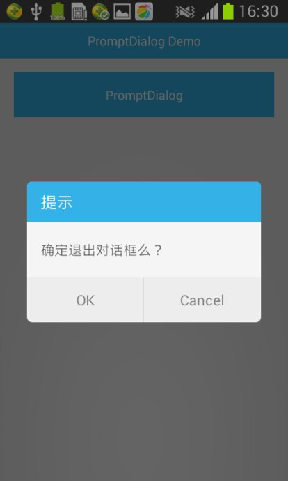

#Usage
You can use like this:
##STEP1
In you project,"Properties -> Android -> Library -> Add -> PromptyDialog",so you already add this lib.
##STEP2
In you project,add the following code:

```java
{
new PromptDialog.Builder(this)
.setTtile("提示")
.setMessage("确定删除xx?")
.setButton1("确定", new PromptDialog.OnClickListener() {
			
			@Override
			public void onClick(Dialog dialog, int which) {
				dialog.dismiss();
			}
		})
.show();
}
```
The default view style is PromptDialog.VIEW_STYLE_NORMAL,and you can also change view style:
```java
{
new PromptDialog.Builder(this)
.setTtile("提示")
.setViewStyle(PromptDialog.VIEW_STYLE_TITLEBAR)
.setMessage("确定删除xx么?")
.setButton1("确定", new PromptDialog.OnClickListener() {
			
			@Override
			public void onClick(Dialog dialog, int which) {
				dialog.dismiss();
			}
		})
.show();
}
```
View Style:
- PromptDialog.VIEW_STYLE_NORMAL,
- PromptDialog.VIEW_STYLE_TITLEBAR,
- PromptDialog.VIEW_STYLE_TITLEBAR_SKYBLUE.

#Demo Snapshot


